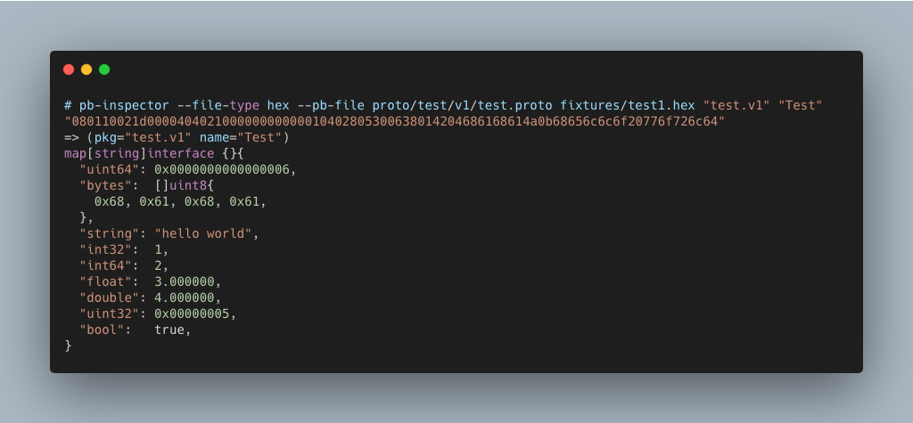

<p align="center">
  <b>
    <span style="font-size:larger;">pb-inspector-go</span>
  </b>
  <br />
   <a href="https://travis-ci.org/detailyang/pb-inspector-go"></a>
   <a href="https://ci.appveyor.com/project/detailyang/pb-inspector-go"></a>
   <br />
   <b>"pb-inspector-go" inpsects the protobuf binary file to debug with or without schema</b>
   <p>many thanks to <a href="https://github.com/emicklei">emicklei</a> who writes the protobuf go parser</p>

   
</p>

# Install

* from github:
    go get github.com/detailyang/protobuf-insepctor-go/cmd
* from source:
    make build

# Usage

## Without schema

````bash
echo 08ffff01100840f7d438 | xxd -r -p | bin/pb-inspector -
````

## With schema

````bash
bin/pb-inspector --file-type hex  --pb-file proto/test/v1/test.proto  fixtures/test1.hex "test.v1" "Test"
````
